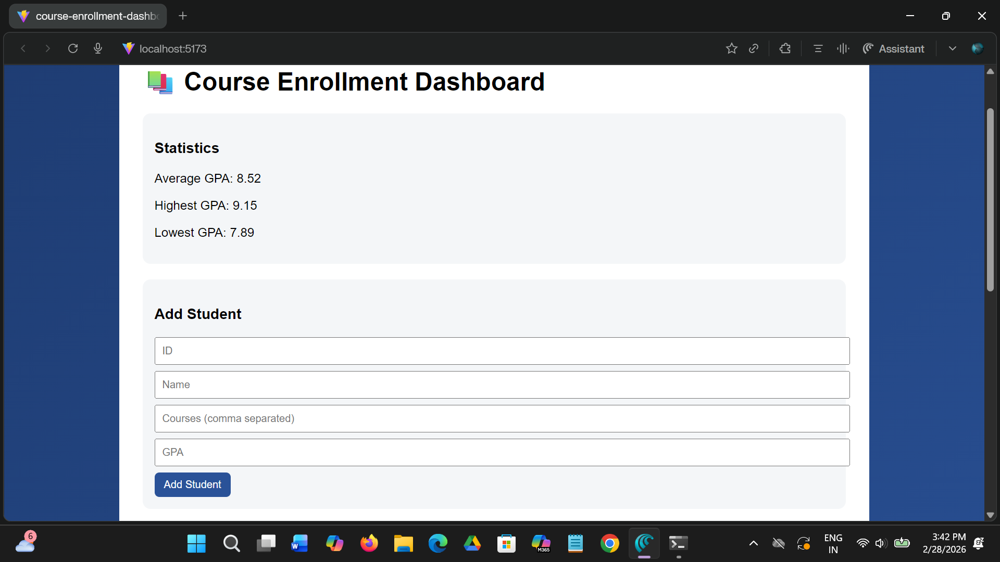
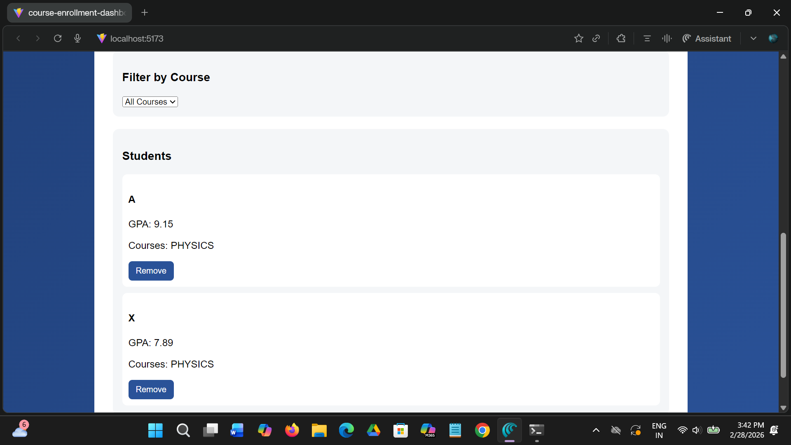

# 📚 Course Enrollment Dashboard

An advanced ReactJS dashboard for managing student course enrollments using modern data structures and optimized rendering.

---

## 🚀 Features

- Add new student
- Remove student by ID
- Display students sorted by GPA (Descending)
- Filter students by course
- Display all unique courses
- GPA statistics (Average, Highest, Lowest)
- LocalStorage persistence
- Optimized using useMemo
- No direct state mutation

---

## 🧠 Data Structures Used

### 🔹 Map
Used internally for:

Map<number, Student>

- O(1) insertion
- O(1) deletion
- O(1) lookup

### 🔹 Set
Used for:

Set<string> enrolledCourses

- Ensures course uniqueness
- O(1) average lookup

---

## ⚙️ Technologies Used

- React (Functional Components)
- Vite
- useState
- useMemo
- useEffect
- JavaScript ES6+

---
## 📸 Application Screenshots

### Dashboard:
<p align="center">
  
</p>

### Filter Functionality:
<p align="center">
  
</p>

## 📊 Time Complexity Analysis

### Filtering Students by Course

Let:
- n = number of students

Operation:

students.filter(student => student.enrolledCourses.has(course))

- filter → O(n)
- Set.has() → O(1)

Total Time Complexity:

O(n)

Space Complexity:

O(n)

---

## 🗂 Project Structure
src/
│
├── components/
├── hooks/
├── styles/
├── App.jsx
└── main.jsx

---

## ▶️ How To Run

```bash
npm install
npm run dev

📌 Author

Aritra Talukdar
CSE Undergraduate
